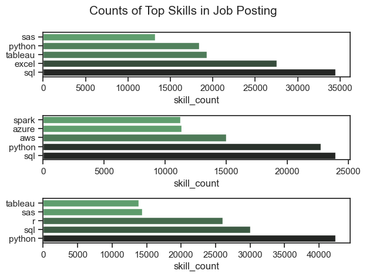
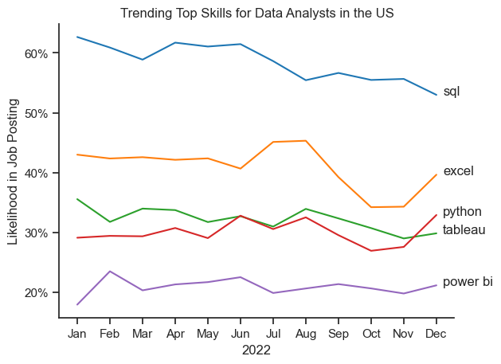
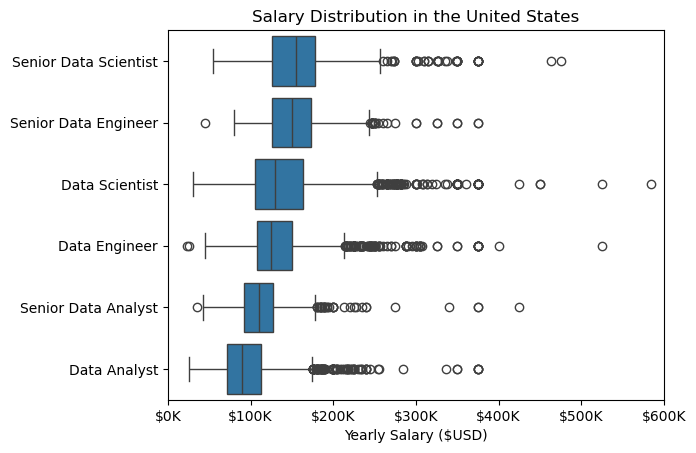
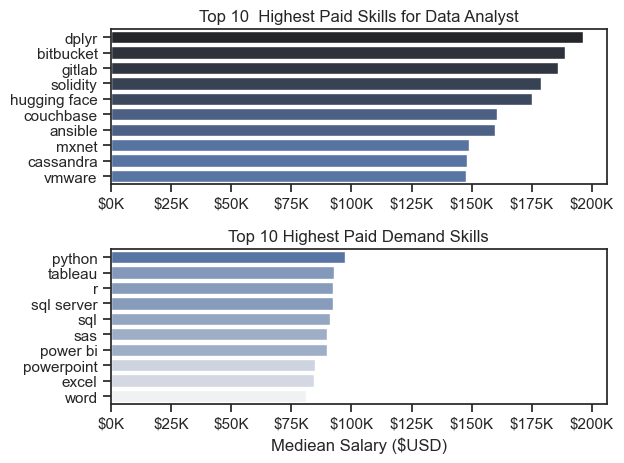

# **Overview**

Welcome to my analysis of the data job market, with a specific focus on data analyst roles. This project was driven by a desire to better understand industry trends and identify the most valuable skills for aspiring and current data analysts. By analyzing job demand and salary data, this study aims to provide insights into the **most lucrative and in-demand skills** for optimizing career opportunities in data analytics.

The data for this project comes from  **Luke Barousse's Python Course** , which serves as a reliable foundation, offering comprehensive details on job titles, salaries, locations, and key technical skills. Through a series of Python-driven analyses, I explore essential questions

# The Questions

Below are the questions I want to answer in my project:

1. What are the skills most in demand for the top 3 most popular data roles?
2. How are in-demand skills trending for Data Analysts?
3. How well do jobs and skills pay for Data Analysts?
4. What are the optimal skills for data analysts to learn? (High Demand AND High Paying)

# Tools I used

For my deep dive into the data analyst job market, I harnessed the power of several key tools:

* **Python:** The backbone of my analysis, allowing me to analyze the data and find critical insights.I also used the following Python libraries:
  * **Pandas Library:** This was used to analyze the data.
  * **Matplotlib Library:** I visualized the data.
  * **Seaborn Library:** Helped me create more advanced visuals.
* **Jupyter Notebooks:** The tool I used to run my Python scripts which let me easily include my notes and analysis.
* **Visual Studio Code:** My go-to for executing my Python scripts.
* **Git & GitHub:** Essential for version control and sharing my Python code and analysis, ensuring collaboration and project tracking.

# Data Preparation and Cleanup

This section outlines the steps taken to prepare the data for analysis, ensuring accuracy and usability.

## Import & Clean Up Data

I start by importing necessary libraries and loading the dataset, followed by initial data cleaning tasks to ensure data quality.

```
# Importing Libraries
import ast
import pandas as pd
import seaborn as sns
from datasets import load_dataset
import matplotlib.pyplot as plt  

# Loading Data
dataset = load_dataset('lukebarousse/data_jobs')
df = dataset['train'].to_pandas()

# Data Cleanup
df['job_posted_date'] = pd.to_datetime(df['job_posted_date'])
df['job_skills'] = df['job_skills'].apply(lambda x: ast.literal_eval(x) if pd.notna(x) else x)
```

# The Analysis

## 1. What are the most demanded skills for the top 3 most popular data roles?

To find the mos demanded skills for the top 3 most popular data roles. I filtered out those positions by which ones were the most popular, and go the top 5 skills for these top 3 roles. This query highlights the most popular job titles and their top skills, showing which skills I should pay attention to depending on the role I'm targeting.

View my notebook with detailed steps here: [[2_Skills_count.ipynb]()](Final_Project\2_Skills_count.ipynb)

### Visualize data

```
python
fig, ax = plt.subplots(len(job_titles), 1)

sns.set_theme(style='ticks')
for i, job_title in enumerate(job_titles):
    df_plot = df_skills_count[df_skills_count['job_title_short'] == job_title].head(5)
    # df_plot.plot(kind = 'barh', x ='job_skills', y ='skill_count', ax = ax[i], title = job_title)
    sns.barplot(data= df_plot, x = 'skill_count', y = 'job_skills', ax = ax[i], hue= 'skill_count', palette= 'dark:g_r')
    ax[i].invert_yaxis()
    ax[i].set_ylabel('')
    ax[i].legend().set_visible(False)

fig.suptitle('Counts of Top Skills in Job Posting', fontsize = 15)
plt.tight_layout()
plt.show()
```

### Results



### Insights

* **SQL dominates across all roles** – It appears as the most in-demand skill for Data Analysts, Data Engineers, and Data Scientists.
* **Python is consistently valuable** – Featured prominently in all three roles, reinforcing its importance in data-related jobs.
* **Excel & Tableau are strong for Data Analysts** – These visualization tools are highly relevant for analysts but less emphasized in other roles.
* **Cloud & Big Data skills for Data Engineers** – AWS, Azure, and Spark are unique to the Data Engineer role, highlighting the focus on cloud infrastructure.
* **R is mainly relevant for Data Scientists** – Unlike Analysts and Engineers, Data Scientists use R more frequently.
* **SAS is still used but less dominant** – Present across roles but not as high as Python and SQL

## 2. How are in-demand skills trending for Data Analysts?

To understand the most in-demand skills for Data Analysts, I first identified the  top three most popular data-related job titles . After filtering the job postings, I extracted the top five most frequently mentioned skills for each of these roles.

### Visualize Data

```
python
sns.lineplot(data = df_plot_trend, palette= 'tab10', legend= False, dashes= False)

sns.despine()
plt.title('Trending Top Skills for Data Analysts in the US')
plt.ylabel('Likelihood in Job Posting')
plt.xlabel('2022')
sns.set_theme(style='ticks')

from matplotlib.ticker import PercentFormatter
ax = plt.gca()
ax.yaxis.set_major_formatter(PercentFormatter(decimals= 0))

for i in range(5):
    plt.text(11.2,df_plot_trend.iloc[-1,i], df_plot_trend.columns[i])
```

### Results



### Insights

* **SQL remains the most in-demand skill**
  * Consistently above  **60% likelihood in job postings** , making it a must-have skill for Data Analysts.
  * Slight  **decline in the second half of the year** , but still dominant.
* **Excel demand fluctuates but declines toward year-end**
  * Stable demand in the first half of the year, with a  **spike around mid-year (June-August)** .
  * **Notable drop in Q3** , possibly due to increased preference for more advanced tools.
* **Python shows steady growth**
  * Fluctuates around  **30% throughout the year** , maintaining relevance.
  * **Slight increase in December** , indicating rising demand in job postings.
* **Tableau demand shows a gradual decline**
  * Started the year near  **30%** , but  **dropped toward the second half of the year** .
  * Could indicate a shift towards other BI tools (e.g., Power BI) or automaton tools.

## 3. How well do jobs and skills pay for Data Analysts?

### Salary Analysis for Job Scounting

To understand the salary landscape for Data Analysts, I analyzed compensation trends across various job titles and key skills. This analysis helps identify which roles and skill sets offer the highest earning potential, allowing for more strategic career planning.

### Visualize Data

```
python
sns.boxplot(data = df_us_top6, x = 'salary_year_avg', y = 'job_title_short', order = job_order)

ax = plt.gca()
ax.xaxis.set_major_formatter(plt.FuncFormatter(lambda x, pos: f'${int(x/1000)}K'))
plt.xlim(0,600000)
plt.title('Salary Distribution in the United States')
plt.xlabel('Yearly Salary ($USD)')
plt.ylabel('')
plt.show()

```

```
python
# # Create a figure with two vertically stacked subplots
fig, ax = plt.subplots(2,1)

# Set the Seaborn theme for better aesthetics
sns.set_theme(style='ticks')

# ------------------- First Bar Plot ------------------- #

# Create a horizontal bar plot for the highest-paid skills for Data Analysts
sns.barplot(data= df_Da_Top_pay, x='median', y = df_Da_Top_pay.index, ax = ax[0], hue = 'median', palette= 'dark:b_r', legend= False)

# Alternative approach (commented out) using Pandas built-in plotting function
# df_Da_Top_pay.plot(kind = 'barh', y = 'median', ax = ax[0], legend= False)

# Set the title for the first subplot
ax[0].set_title('Top 10  Highest Paid Skills for Data Analyst')

# Remove axis labels for a cleaner look
ax[0].set_xlabel('')
ax[0].set_ylabel('')

# Format x-axis labels to display salaries in thousands (e.g., "$50K" instead of "50000")
ax[0].xaxis.set_major_formatter(plt.FuncFormatter(lambda x , pos: f'${int(x/1000)}K'))

# ------------------- Second Bar Plot ------------------- #

# Create a horizontal bar plot for the highest-paid in-demand skills for Data Analysts
sns.barplot(data= df_Da_skills, x='median', y = df_Da_skills.index, ax = ax[1], hue= 'median', palette= 'light:b', legend= False)

# Ensure both subplots share the same x-axis range for better comparison
ax[1].set_xlim(ax[0].get_xlim())

# Set the title for the second subplot
ax[1].set_title('Top 10 Highest Paid Demand Skills')

# Label the x-axis appropriately
ax[1].set_xlabel('Mediean Salary ($USD)')

# Remove the y-axis label for a cleaner look
ax[1].set_ylabel('')

# Format x-axis labels for salary in thousands (same as the first subplot)
ax[1].xaxis.set_major_formatter(plt.FuncFormatter(lambda x , pos: f'${int(x/1000)}K'))


# ------------------- Final Formatting ------------------- #

# Adjust subplot spacing to prevent overlapping titles and labels
fig.tight_layout()
plt.show()

```

### Result





### Insights

**Senior roles command significantly higher salaries**

* **Senior Data Scientists & Senior Data Engineers** have the highest median salaries, often exceeding  **$150K** .
* **Senior Data Analysts** earn notably more than entry-level Data Analysts, but the gap is smaller than in other roles.

**Data Science & Data Engineering pay more than Data Analysis**

* **Data Scientists and Data Engineers** earn higher median salaries than Data Analysts.
* Their  **upper salary ranges extend past $250K-$300K** , while Data Analysts mostly cap under  **$200K** .

**Significant salary variation & outliers**

* All roles show  **large salary ranges** , with some reaching  **$400K-$500K+** , likely due to high-paying tech companies, FAANG roles, or specialized skills.
* **Outliers are more frequent for Data Scientists & Engineers** , suggesting opportunities for exceptionally high salaries.

**Top 10 Highest Paid Skills for Data Analysts**

* **Programming and DevOps-related skills dominate** the highest-paid category.
* **dplyr** (R package),  **bitbucket** ,  **gitlab** , and **solidity** (blockchain) lead in salary potential, exceeding **$175K** median salary.
* **Hugging Face and Couchbase** , which focus on AI/ML and NoSQL databases, also offer high salaries.
* **Ansible and VMware** indicate a demand for  **automation and cloud infrastructure knowledge** .

**Top 10 Highest Paid Demand Skills**

* **Python remains the highest-paid mainstream skill** , reinforcing its importance in data analysis and engineering.
* **Tableau and Power BI** are highly valued, suggesting continued demand for data visualization.
* **SQL Server and SQL** rank high, confirming that database expertise is key for high-paying roles.
* **Excel, Word, and PowerPoint** appear at the lower end, indicating that while still relevant, they **do not command the highest salaries** compared to technical skills.

**Key Takeaways**

* Specialized programming tools (dplyr, Solidity) and DevOps skills pay more than general data skills.
* Python, SQL, and BI tools remain critical for well-paying jobs.
* Cloud, database, and automation skills (Cassandra, Ansible, VMware) provide strong earning potential.
* While Excel and PowerPoint are useful, they are not associated with the highest salaries.

## 4. What is the most optimal skill to learn for Data Analysts?

### Visualize Data

```
python
sns.scatterplot(
    data=df_plot,
    x='skill_percent',
    y='median_salary',
    hue='technology'
)

sns.despine()
sns.set_theme(style='ticks')

# Prepare texts for adjustText
texts = []
   
for i, txt in enumerate(df_Da_skills_high_demand.index):
    y = df_Da_skills_high_demand['median_salary'].iloc[i]  # Define y before modifying
  
    if txt == "power bi":
        y += 900  # Move up slightly
    elif txt == "sas":
        y -= 900  # Move down slightly

    texts.append(plt.text(df_Da_skills_high_demand['skill_percent'].iloc[i], 
                          y, txt))  # Use the modified y value

# Adjust text to avoid overlap
adjust_text(texts, arrowprops=dict(arrowstyle='->', color='gray'))

# Set axis labels, title, and legend
plt.xlabel('Percent of Data Analyst Jobs')
plt.ylabel('Median Yearly Salary')
plt.title('Most Optimal Skills for Data Analysts in the US')
plt.legend(title='Technology')

from matplotlib.ticker import PercentFormatter
ax = plt.gca()
ax.yaxis.set_major_formatter(plt.FuncFormatter(lambda y, pos: f'${int(y/1000)}K'))
ax.xaxis.set_major_formatter(PercentFormatter(decimals=0))

# Adjust layout and display plot 
plt.tight_layout()
plt.show()
```

### Result


*A scatter plot visualizing the most optimal skills (high pyaing & high demand) for data analysts in the US.*

### Insights

* **Database Skills (colored green) Offer Strong Salary Prospects**
  Skills such as **SQL Server and Oracle** are associated with some of the highest salaries (~$94K-$97K). This reflects the growing demand for data management expertise, as organizations increasingly rely on structured databases to store and analyze large datasets.
* **Analyst Tools (colored orange) Are Widely Used and Well-Paid**
  Tools like **Tableau and Power BI** are among the most frequently mentioned in job postings. While their salaries (~$90K) are slightly lower than programming or database skills, they remain crucial for data visualization and business intelligence, making them indispensable in analytical roles.
* **Cloud Technologies (colored red) Indicate High Value in Specialized Roles**
  Cloud-related skills, including  **Oracle and AWS** , offer competitive salaries (~$96K+). This suggests that companies value expertise in cloud-based data storage and computing, particularly as businesses migrate towards scalable cloud solutions.**Programming Skills (colored blue) Lead to Higher Salaries**
* **Programming Skills (colored blue) Lead to Higher Salaries**
  Programming languages such as **Python and SQL** tend to cluster at higher salary levels, with Python offering one of the highest median salaries (~$98K). This suggests that proficiency in programming can significantly enhance earning potential in the data analytics field.

### Key Takeaways from This Project

Throughout this project, I gained a deeper understanding of the **data analyst job market** while refining my  **technical skills in Python** , particularly in data manipulation and visualization. Here are some of the key lessons I learned:

* **Advanced Python Techniques** : Leveraging powerful libraries like **Pandas** for data manipulation and **Seaborn/Matplotlib** for visualization enabled me to conduct complex data analysis with greater efficiency and clarity.
* **The Critical Role of Data Cleaning** : I realized that **data preprocessing is a fundamental step** in any analysis. Cleaning and structuring data properly ensures accuracy and reliability in the insights drawn from it.
* **Strategic Skill Development** : This project highlighted the importance of aligning technical skills with  **market demand** . By analyzing the relationship between  **skill popularity, salary potential, and job availability** , I gained a **data-driven perspective** on optimizing career growth in the tech industry.

## OverView Ingsights

This project provided several key insights into the  **data job market for analysts** , shedding light on the relationship between  **skill demand, salary potential, and market trends** :

* **Skill Demand and Salary Correlation** : There is a noticeable link between  **the demand for specific skills and the salaries they command** . Specialized and advanced skills like **Python and Oracle** tend to result in higher compensation, reflecting their value in data analytics roles.
* **Evolving Market Trends** : The  **demand for certain skills is constantly shifting** , emphasizing the **dynamic nature** of the data job market. Staying updated with these trends is crucial for **career growth and long-term employability** in the field.
* **Economic Value of Skills** : Understanding which **skills are both in-demand and highly paid** allows data analysts to prioritize learning efficiently. **Strategic upskilling** in the right technologies can  **maximize career opportunities and salary potential** .

## Challenges I Faced

This project was not without its challenges, but each obstacle provided valuable learning experiences:

* **Data Inconsistencies** : Handling **missing or inconsistent data** required careful **data-cleaning techniques** to maintain the integrity and accuracy of the analysis. Ensuring a **structured, reliable dataset** was a crucial step before drawing any insights.
* **Complex Data Visualization** : Creating **effective visual representations** of complex datasets was both challenging and essential. Striking the right balance between **clarity and informativeness** was key to making insights  **accessible and compelling** .
* **Balancing Breadth and Depth** : Deciding how deeply to explore each analysis while maintaining a **comprehensive overview** of the data landscape required constant  **adjustment** . Finding the **right level of granularity** ensured that the project was both **insightful and well-rounded** without becoming overly detailed in any single area.

## Conclusion

This exploration into the **data analyst job market** has been incredibly insightful, shedding light on the **key skills and trends** that shape this evolving field. The findings not only deepen my understanding of the industry but also provide **actionable guidance** for those looking to advance their careers in data analytics.

As the job market continues to evolve, **ongoing analysis will be crucial** to staying ahead of emerging trends and technological advancements. This project serves as a  **strong foundation for future explorations** , emphasizing the importance of **continuous learning and adaptation** in the ever-changing landscape of data analytics.
